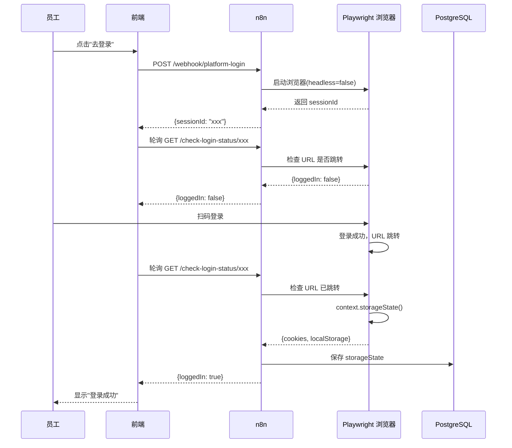
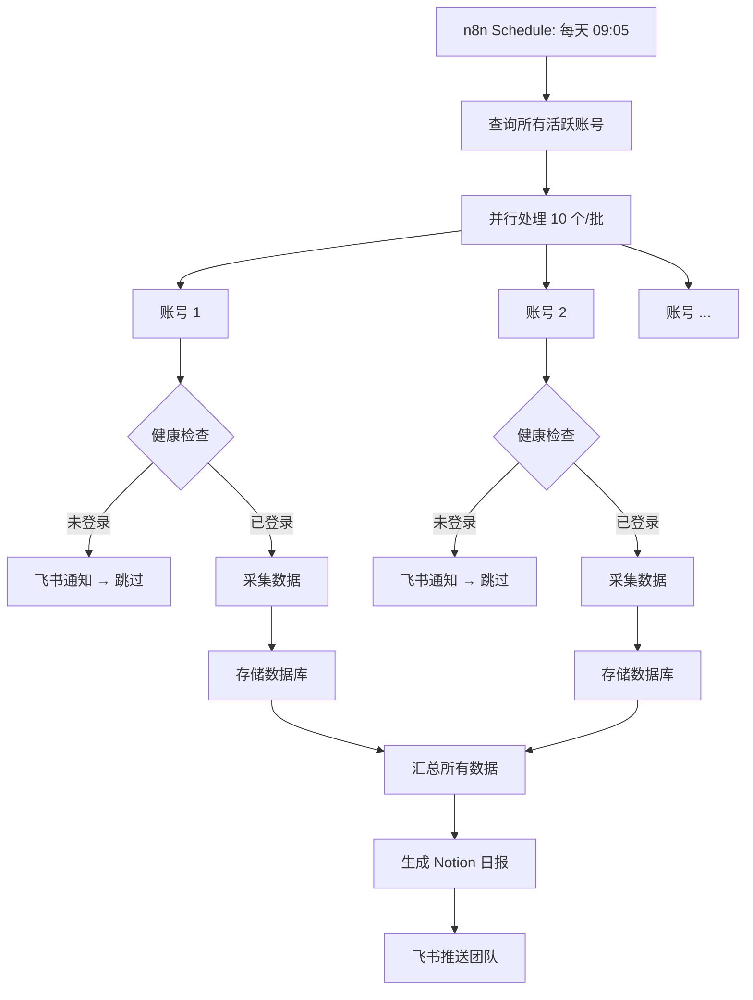

# N8n Social Media Scraper

**自动化社交媒体数据采集平台** - 基于 n8n 工作流引擎，支持多平台数据采集、登录状态管理、数据分析和团队协作。

<div align="center">

[](LICENSE)
[](https://nodejs.org/)
[](https://www.typescriptlang.org/)
[](https://reactjs.org/)

</div>

---

## 目录

- [项目简介](#项目简介)
- [核心特性](#核心特性)
- [快速开始](#快速开始)
- [架构概览](#架构概览)
- [项目结构](#项目结构)
- [技术栈](#技术栈)
- [文档导航](#文档导航)
- [贡献指南](#贡献指南)

---

## 项目简介

这是一个企业级的社交媒体数据采集和管理平台，帮助团队：

- **自动化采集**：每日定时采集多平台账号数据（粉丝、曝光、互动等）
- **智能登录管理**：自动检测登录状态，失效时通知相关人员
- **数据分析**：汇总统计、趋势分析、生成日报
- **团队协作**：权限管理、通知推送、Notion/飞书集成

### 支持平台

- 小红书 (XHS)
- 微博 (Weibo)
- X (Twitter)
- 抖音 (Douyin) - 即将支持
- 视频号 (Shipin) - 即将支持

---

## 核心特性

### 1. 工作流自动化
- 基于 n8n 可视化编排，所有业务逻辑一目了然
- 定时触发、条件判断、并行处理、错误重试
- 无需编码即可调整业务流程

### 2. 智能登录管理
- Cookie/Session 持久化存储
- 定期健康检查，登录失效自动通知
- 员工扫码登录，浏览器自动化技术

### 3. 数据采集与存储
- Playwright 浏览器自动化，模拟真实用户操作
- 支持多账号并行采集
- PostgreSQL 时序数据存储

### 4. 数据分析与报告
- 粉丝增长趋势、曝光量统计、TOP 账号排名
- 自动生成 Notion 日报
- 飞书/Slack 团队通知

### 5. 现代化前端
- React + TypeScript + Vite
- 账号管理、数据看板、登录助手
- 移动端适配

---

## 快速开始

### 前置要求

- Docker 和 Docker Compose（推荐）
- 或：Node.js >= 18.0, PostgreSQL >= 15

### 3 分钟启动

```bash
# 1. 克隆项目
git clone https://github.com/yourusername/n8n-social-media-scraper.git
cd n8n-social-media-scraper

# 2. 配置环境变量
cp .env.example .env
# 编辑 .env 填入必要配置

# 3. 一键启动（Docker）
docker-compose up -d

# 4. 访问服务
# n8n 界面: http://localhost:5678
# 前端界面: http://localhost:5173
# Collector API: http://localhost:3000/health
```

### 初始化数据库

```bash
# 方式1: Docker 自动初始化（已配置）
# 数据库会在首次启动时自动执行 database/schema.sql

# 方式2: 手动初始化
docker exec -i social-metrics-postgres psql -U n8n_user -d n8n_social_metrics < database/schema.sql

# 插入测试账号
docker exec -i social-metrics-postgres psql -U n8n_user -d n8n_social_metrics <<EOF
INSERT INTO accounts (platform, account_id, display_name, is_active) VALUES
  ('xhs', 'xhs_main', '小红书-主号', true),
  ('weibo', 'weibo_main', '微博-主号', true),
  ('x', 'x_main', 'X-主号', true)
ON CONFLICT (platform, account_id) DO NOTHING;
EOF
```

### 部署 n8n 工作流

```bash
# 安装依赖
npm install

# 部署工作流到 n8n（需配置 N8N_API_KEY）
npm run deploy:workflow

# 部署并激活
npm run deploy:activate
```

### 启动开发服务

```bash
# 启动 Collector API
cd collector
npm install
npm run dev

# 启动前端（新终端）
cd frontend
npm install
npm run dev
```

---

## 架构概览

```
┌─────────────────────────────────────────────────────────┐
│                   Frontend (React)                      │
│  - 账号管理  - 数据看板  - 登录助手                      │
│                                                          │
│  所有操作通过 n8n Webhook 调用 ↓                         │
└────────────────┬────────────────────────────────────────┘
                 │ HTTPS
                 ↓
┌─────────────────────────────────────────────────────────┐
│                  n8n (核心中台)                          │
│                                                          │
│  Workflows:                                              │
│  ├─ platform-login         (员工扫码登录)               │
│  ├─ check-login-status     (检查登录状态)               │
│  ├─ get-accounts           (获取账号列表)               │
│  ├─ health-check           (健康检查)                   │
│  ├─ trigger-collection     (手动触发采集)               │
│  ├─ query-metrics          (查询数据)                   │
│  └─ daily-collection       (定时自动采集 - 每天 09:05)  │
│                                                          │
│  内部节点:                                               │
│  ├─ HTTP Request → Collector API                        │
│  ├─ PostgreSQL → 读写数据库                             │
│  ├─ Notion → 创建日报                                   │
│  └─ 飞书/Slack → 发送通知                               │
└────────┬────────────┬──────────────┬─────────────────────┘
         │            │              │
         ↓            ↓              ↓
   ┌──────────┐  ┌─────────┐  ┌──────────────┐
   │Collector │  │PostgreSQL│ │Notion + 飞书  │
   │   API    │  │          │ │              │
   │Workers   │  │          │ │              │
   └──────────┘  └─────────┘  └──────────────┘
```

### 核心设计理念

1. **n8n 为中心**：所有业务逻辑在 n8n 中可视化编排
2. **API 分层**：Collector API 只提供原子能力（采集、存储、通知）
3. **Workers 插件化**：每个平台独立 Worker，易于扩展
4. **前端轻量化**：仅负责展示和触发，不包含业务逻辑

---

## 项目结构

```
n8n-social-media-scraper/
│
├── docs/                           # 📚 项目文档
│   ├── CORE.md                    # Core API 层文档
│   ├── MODULES.md                 # Modules 层文档
│   ├── API.md                     # API 接口文档
│   ├── WORKFLOWS.md               # 工作流文档
│   ├── DEPLOYMENT.md              # 部署指南
│   ├── DEVELOPMENT.md             # 开发指南
│   ├── FRONTEND.md                # 前端文档
│   ├── NOTION_INTEGRATION.md      # Notion 集成
│   ├── FEISHU_INTEGRATION.md      # 飞书集成
│   ├── FAQ.md                     # 常见问题
│   └── CHANGELOG.md               # 更新日志
│
├── collector/                      # 🔧 Collector API (Node.js + Express)
│   ├── src/
│   │   ├── server.ts              # 主服务器
│   │   ├── routes/                # API 路由
│   │   │   ├── accounts.ts        # 账号管理
│   │   │   ├── healthcheck.ts     # 健康检查
│   │   │   ├── collect.ts         # 数据采集
│   │   │   ├── store.ts           # 数据存储
│   │   │   ├── report.ts          # 报告生成
│   │   │   ├── notify.ts          # 通知发送
│   │   │   └── logs.ts            # 日志记录
│   │   └── workers/               # 平台爬虫插件
│   │       ├── worker.interface.ts
│   │       ├── xhs.worker.ts      # 小红书
│   │       ├── weibo.worker.ts    # 微博
│   │       └── x.worker.ts        # X (Twitter)
│   ├── db/
│   │   └── schema.sql             # 数据库结构
│   ├── package.json
│   ├── tsconfig.json
│   └── README.md
│
├── frontend/                       # 🎨 前端 (React + TypeScript + Vite)
│   ├── src/
│   │   ├── api/
│   │   │   ├── client.ts          # Collector API 客户端
│   │   │   └── n8n-client.ts      # n8n Webhook 客户端
│   │   ├── pages/
│   │   │   ├── Dashboard.tsx      # 数据看板
│   │   │   ├── Accounts.tsx       # 账号管理
│   │   │   └── LoginPage.tsx      # 登录页面
│   │   ├── App.tsx
│   │   └── main.tsx
│   ├── package.json
│   ├── vite.config.ts
│   └── README.md
│
├── n8n-workflows/                  # 🔀 n8n 工作流 JSON
│   ├── 1-platform-login.json
│   ├── 2-check-login-status.json
│   ├── 3-get-accounts.json
│   ├── 4-health-check.json
│   ├── 5-trigger-collection.json
│   ├── 6-query-metrics.json
│   ├── 7-daily-collection.json
│   └── README.md
│
├── database/                       # 🗄️ 数据库脚本
│   └── schema.sql
│
├── scripts/                        # 🛠️ 工具脚本
│   └── n8n_deploy_workflow.ts     # n8n 工作流部署
│
├── spec/                           # 📋 规格说明
│   ├── api.contract.md
│   └── workflow.social_metrics_master.md
│
├── docker-compose.yml              # 🐳 Docker 编排
├── Dockerfile                      # 🐳 Collector API 镜像
├── .env.example                    # 🔐 环境变量模板
├── package.json                    # 📦 根项目配置
├── ARCHITECTURE.md                 # 🏗️ 架构文档
└── README.md                       # 📖 本文件
```

---

## 技术栈

### 后端
- **n8n**: 工作流自动化引擎
- **Node.js + Express**: Collector API 服务
- **TypeScript**: 类型安全
- **Playwright**: 浏览器自动化
- **PostgreSQL**: 关系型数据库

### 前端
- **React 18**: UI 框架
- **TypeScript**: 类型安全
- **Vite**: 构建工具
- **Tailwind CSS**: 样式框架
- **Recharts**: 数据可视化
- **React Router**: 路由管理
- **Axios**: HTTP 客户端

### 基础设施
- **Docker**: 容器化
- **Nginx**: 反向代理（生产环境）
- **Notion API**: 日报输出
- **飞书 API**: 团队通知

---

## 文档导航

### 新手入门
1. [快速开始](docs/DEPLOYMENT.md#快速开始) - 5 分钟运行起来
2. [架构概览](ARCHITECTURE.md) - 理解系统设计
3. [常见问题](docs/FAQ.md) - 解决常见问题

### 开发者
1. [开发指南](docs/DEVELOPMENT.md) - 开发环境搭建
2. [API 文档](docs/API.md) - 所有 API 接口
3. [前端文档](docs/FRONTEND.md) - 前端开发指南
4. [工作流文档](docs/WORKFLOWS.md) - n8n 工作流详解

### 运维
1. [部署指南](docs/DEPLOYMENT.md) - 生产环境部署
2. [Notion 集成](docs/NOTION_INTEGRATION.md) - 配置 Notion
3. [飞书集成](docs/FEISHU_INTEGRATION.md) - 配置飞书应用

### 架构设计
1. [Core 层文档](docs/CORE.md) - Collector API 详解
2. [Modules 层文档](docs/MODULES.md) - 前端和工作流
3. [数据库设计](database/schema.sql) - 数据表结构

---

## 使用场景

### 场景 1: 每日自动采集
- **09:05**: n8n 定时触发
- **自动执行**: 健康检查 → 采集数据 → 存储数据库
- **生成报告**: Notion 日报 + 飞书通知
- **人工介入**: 仅在登录失效时需要扫码

### 场景 2: 员工登录平台账号
- 打开前端 → 账号管理 → 点击"去登录"
- n8n 启动 Playwright 浏览器
- 员工扫码登录
- 自动保存 Cookie/Session
- 下次自动复用

### 场景 3: 手动触发采集
- 打开前端 → 账号管理 → 点击"立即采集"
- n8n 立即执行采集任务
- 实时查看结果

### 场景 4: 数据分析
- 打开前端 → 数据看板
- 查看粉丝增长趋势
- 按平台对比数据
- 查看 TOP 账号

---

## 核心流程

### 登录流程



### 每日采集流程



---

## 快速链接

- **在线演示**: [https://demo.example.com](https://demo.example.com)
- **问题反馈**: [GitHub Issues](https://github.com/yourusername/n8n-social-media-scraper/issues)
- **更新日志**: [CHANGELOG.md](docs/CHANGELOG.md)
- **贡献指南**: [CONTRIBUTING.md](#贡献指南)

---

## 贡献指南

我们欢迎所有形式的贡献！

### 如何贡献

1. **Fork 本仓库**
2. **创建特性分支** (`git checkout -b feature/AmazingFeature`)
3. **提交更改** (`git commit -m 'Add some AmazingFeature'`)
4. **推送到分支** (`git push origin feature/AmazingFeature`)
5. **提交 Pull Request**

### 开发规范

- 遵循 TypeScript/ESLint 规则
- 编写清晰的 commit message
- 添加必要的注释和文档
- 确保测试通过

### 添加新平台

1. 创建 Worker: `collector/src/workers/platform.worker.ts`
2. 实现接口: `healthCheck()` 和 `collect()`
3. 更新文档: `docs/DEVELOPMENT.md`
4. 提交 PR

---

## 许可证

MIT License - 详见 [LICENSE](LICENSE) 文件

---

## 联系我们

- **邮箱**: your-email@example.com
- **微信**: your-wechat-id
- **讨论组**: [加入我们的 Discord](https://discord.gg/xxx)

---

<div align="center">
Made with ❤️ by Your Team
</div>
